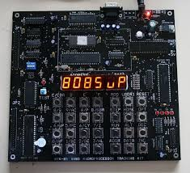

<h1 align="center">Second Year Units in Campus</h1>

:information_source: &nbsp;This repo contains concepts, exercises and solutions to Computer related Units I did my second year as a Computer Science Student.

 
 
<table margin-left="auto" margin-right="auto" >
<tr>
<td> <b><a href="./0x01-COMP_215/README.md">Networking Fundamentals</a></b></a></td>
<td> <b><a href="./0x02-COMP_216/README.md">S/W  Interface Design</a></b></a></td>
<td> <b><a href="./0x04-COMP_211/README.md">Assembly Programming</a></b></a></td>
</tr>

<tr>
<td> <b><a href="./0x05-COMP_214/README.md">Database Systems</a></b></a></td>
<td> <b><a href="./0x06-COMP_213/README.md">Object Oriented Programming</a></b></a></td>
<td> <b><a href="./0x04-COMP_212/README.md">Software Engineering</a></b></a></td>
</tr>
</table>

 
